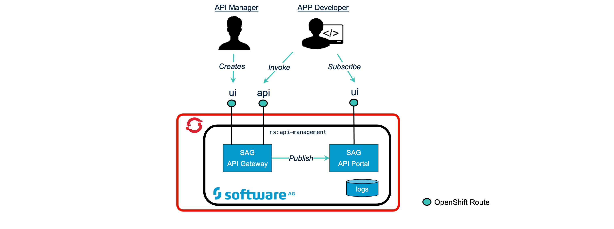

# SAG API Management on Red Hat OpenShift
   

The purpose of this repository is to explain how to install the SAG webMethods API platform on an OpenShift cluster. The goal is to get you up to speed with SAG webMethods API Management as fast as possible with minimal system requirements so it can run even on small scaled OpenShift clusters. 

The SAG webMethods API platform contains two applications, the API Gateway and the API Portal for which seperate Helm charts are provided and thus, can be easily installed seperately.

Note: 
- This repository describes a basic installation of the SAG webMethods API Platform on OpenShift used for DEMO purposes. Do not run the platform in production without changing the architecture to an HA setup and increase container resource requirements.
- Parts of the charts provided in this repository are based on the official SoftwareAG API Management charts altough simplified and fine-tuned for running on Red Hat OpenShift

## Prerequisites
This setup is tested with SAG API Management version 10.7. on a RedHat OpenShift cluster version 4.7.

Make sure you have cluster admin credentials (need to set the [SCC](https://www.openshift.com/blog/managing-sccs-in-openshift)) and that you have Helm 3 installed on your local machine. The cluster must also have enough available RAM depending on which components you want to install (API Gateway alone requires 4GB of RAM).

You must first register your Docker Hub account so the account can pull the necessary Docker images from the Docker store including a trail license (valid for 90days). You can register your account by going to the following locations and click the *Proceed to Checkout* button:
- [Obtain a trail license for the API Gateway](https://hub.docker.com/_/softwareag-apigateway)
- [Obtain a trail license for the API Portal](https://hub.docker.com/_/softwareag-apiportal)

## Configuration
This section describes only the general configuration concepts which are valid for both the API Portal and the API Gateway. For a more application specific configuration, go to the application specfic README files ([API Gateway README](charts/sag-apigateway/README.md), [API Portal README](charts/sag-apiportal/README.md))  

### Disk and Stateful Workloads
Some Pods are storing state to disk or to an NFS share. You can also choose to not persist state on a permanent disk but use the Kubernetes **emptyDir volume**. This is useful for demo purposes only, as the data is permanently deleted when the Pod is removed from the node or when the Pod is rescheduled on another node.

Each statefull workload can be configured using the following Helm values:
- <name-of-workload>.storage.useVolumeClaimTemplate: Whether to use a *Volume Claim Template* to provisiong storage. If set to **false**, you need to provide the name of a *PersistentVolumeClaim* in the field **pvcName**.
- <name-of-workload>.storage.storageClassName: StorageClass to use in case **useVolumeClaimTemplate** is set to **true**
- <name-of-workload>.storage.pvcName: Name of the pvc
- <name-of-workload>.storage.size: Requested storage for this workload
- <name-of-workload>.storage.useEmptyVolume: Whether to use a Kubernetes **emptyDir** volume or not.

### OpenShift Routes & SSL Termination
In OpenShift, we use a `route` object to expose workloads by assigning an externally-reachable hostname to a Kubernetes `service` object. The SAG API Management platform exposes 3 endpoints:
- The API Portal endpoint (~loadbalancer endpoint)
- The API Gateway endpoint (~management endpoint)
- The Integration Server endpoint (~api invocation endpoint)
You can configure the hostname by setting the Helm value `<endpoint-name>.externalFQDN` of that particular endpoint. You can also disable the route by setting the Helm value `<endpoint-name>.route.enabled` to `false`.

To enable SSL for these endpoints, we can configure our OpenShift routes with TLS termination. This is explained in detail [here](docs/ssl.md).


### RunAs User
All portal containers should run as ruser *root* (user: 0) while the API Gateway container runs as user *sagadmin* (user: 1724).

# Installation Steps

## STEP 0 : Initialize Openshift
- Create Project
```sh
OC_PROJECT=sag-api-management
oc new-project $OC_PROJECT
```
- Make sure that the service account which runs our pods has access to the privileged SCC.
```sh
oc adm policy add-scc-to-user privileged system:serviceaccount:$OC_PROJECT:default
 ```
## STEP 1: Create Docker Secret
The cluster must be able to download the image from DockerHub. Therefore, create a secret for [Docker hub](https://hub.docker.com/) access. This dockerhub account must also already be registered to have a proper [license](https://hub.docker.com/_/softwareag-apiportal) for the API Portal and a proper [license](https://hub.docker.com/_/softwareag-apigateway) for the API Gateway. Otherwise, the images cannot be downloaded during the installation process.
The name of the registry secret must match with the Helm variable `image.registrySecret` of your specific Helm *Values* file. 
```sh
oc create secret docker-registry regsecret --docker-server=https://index.docker.io/v1/ --docker-username=<your-docker-hub-id> --docker-password="<your-pass>" --docker-email="your-email"
```
The name of the secret **regsecret** is configured in the Helm configuration so the images are downloaded with the proper Docker Hub credentials.

## STEP 2: Install API Gateway using Helm
First, make sure you added the correct configuration in the Helm value file.

```sh
helm install sag-apigateway ./charts/sag-apigateway -f ./charts/sag-apigateway/values.yaml
```
If rollout was successful, the following output is shown:
```
NAME: sag-apigateway
LAST DEPLOYED: Mon Oct 18 09:58:18 2021
NAMESPACE: sag-api-management
STATUS: deployed
REVISION: 1
TEST SUITE: None
NOTES:
************************************************************************
*** PLEASE BE PATIENT: API Gateway may take a few minutes to install ***
************************************************************************

SAG API Gateway
---------------

You have deployed release: sag-apigateway.

1. Get your API Gateway UI endpoint:
export APIGATEWAY_HOST=$(oc get route sag-apigateway-gateway -o jsonpath='{.spec.host}')
You should be able to access the API Gateway management GUI in a browser through address: https://$APIGATEWAY_HOST

2. Get your API invocation endpoint:
export IS_HOST=$(oc get route sag-apigateway-is -o jsonpath='{.spec.host}')
The base url of your APIs is: https://$IS_HOST
```
The first time, doing a clean install, it can take a time before the API GatewayW Pod is started. This is because the Elasticsearch cluster needs to be initialized. Once this is done, restarts or Pod recreations will be much faster.

## STEP 3: Install API Portal using Helm
Same as with the API Gateway installation, you have to make sure the Helm configuration file (Value file) contains the correct configuration.
```sh
helm install sag-apiportal ./charts/sag-apiportal -f ./charts/sag-apiportal/values.yaml
```
If the rollout was successful, the following output is shown:
```txt
NAME: sag-apiportal
LAST DEPLOYED: Mon Oct 18 21:13:08 2021
NAMESPACE: sag-api-management
STATUS: deployed
REVISION: 1
TEST SUITE: None
NOTES:
************************************************************************
*** PLEASE BE PATIENT: API Portal may take a few minutes to install ***
************************************************************************

SAG API Portal
---------------

You have deployed release: sag-apiportal.
1. Get your API Portal UI endpoint:
export PORTAL_HOST=$(oc get route sag-apiportal-portal -o jsonpath='{.spec.host}')
You should be able to access the API Gateway management GUI in a browser through address: https://$PORTAL_HOST
```
Check that all pods are running and that post deployment jobs ran successfully:
```sh
kubectl get po
returns:
NAME                                                  READY   STATUS      RESTARTS   AGE
sag-apiportal-accserver-0                             1/1     Running     0          2m28s
sag-apiportal-adsadmin-0                              1/1     Running     0          2m28s
sag-apiportal-api-0                                   1/1     Running     0          2m28s
sag-apiportal-change-passwords-tenant-default-bct7w   0/1     Completed   0          2m28s
sag-apiportal-change-passwords-tenant-master-66rfz    0/1     Completed   0          2m28s
sag-apiportal-cloudsearch-0                           1/1     Running     0          2m28s
sag-apiportal-collaboration-0                         1/1     Running     0          2m28s
sag-apiportal-create-tech-user-6cmpr                  0/1     Completed   0          2m28s
sag-apiportal-elasticsearch-0                         1/1     Running     0          2m28s
sag-apiportal-import-license-kws9b                    0/1     Completed   0          2m28s
sag-apiportal-kibana-0                                1/1     Running     0          2m28s
sag-apiportal-loadbalancer-0                          1/1     Running     0          2m28s
sag-apiportal-portalserver-0                          1/1     Running     0          2m28s
sag-apiportal-postgres-0                              1/1     Running     0          2m28s
sag-apiportal-register-smtp-server-w5z5r              0/1     Completed   0          2m28s
sag-apiportal-tm-0                                    1/1     Running     0          2m28s
sag-apiportal-umcadmin-0                              1/1     Running     0          2m28s
sag-apiportal-zookeeper-0                             1/1     Running     0          2m28s
```
## STEP 4: Test
### API Gateway
- Get your API Gateway UI endpoint
```sh
oc get route sag-apigateway-gateway -o jsonpath='{.spec.host}'
```
- Add http:// or https:// (depends on whether you enabled tls or not in your route) before the endpoint and open this URL in a browser:
### API Portal
- Get your API Portal UI endpoint
```sh
oc get route sag-apiportal-portal -o jsonpath='{.spec.host}'
```
- Add http:// or https:// (depends on whether you enabled tls or not in your route) before the endpoint and open this URL in a browser

## Uninstall
To uninstall the API Gateway and API Portal:
```sh
helm uninstall sag-apigateway
helm uninstall sag-apiportal
```

# Enterprise Setup (optional)
You can use the charts included in this repository in an enterprise setup by changing the following:
- Use an PostgreSQL database installed in HA mode.
- Use an ElasticSearch cluster with minimal 3 master nodes.
- Setup Zookooper as an *ensemble* using at least 3 nodes.
- scheduling regular backups
