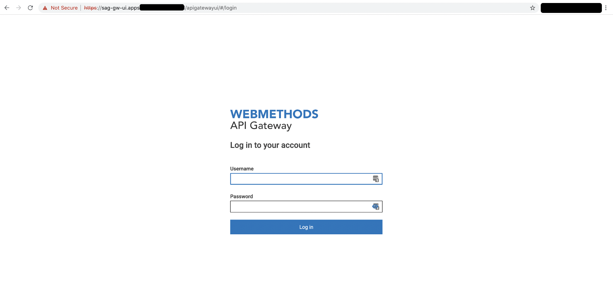

# SAG API Gateway 
This document describes how to install API Gateway on OpenShift. It specifies the values that are required to launch the API Gateway container(s) on OpenShift.

This document contains the following sections:
- [Configuration](#config)
- [Licensing](#licensing)
- [Installation](#installation)

## Configuration <a name="config" />

Make sure to change the Helm configuration variables according to your environment. Values which are required to be set are at least:
- apigateway.externalFQDN
- is.externalFQDN
- apigateway.logs.storageClassName 
- elasticsearch.data.storageClassName

Other important Helm configuration variables are:

| Field                               | Example               | Description                                                                                                                                                                                                                  |
|-------------------------------------|-----------------------|------------------------------------------------------------------------------------------------------------------------------------------------------------------------------------------------------------------------------|
| image.tag                           | 10.7                  | This is the image version and correlates with the webMethods version of   the installed platform.                                                                                                                            |
| image.registrySecret                | hubsecret             | Name of the Secret containing the credentials to pull the SoftwareAG   images from Dockerhub. This secret must be creation in the prerequisites.                                                                             |
| apigateway.externalFQDN             | sag-gw-ui.yourdomain.be | Endpoint of the API Gateway GUI  cluster.                                                                                                                                                                                           |
| apigateway.logs.storageClassName    | nfs                   | Name of the OpenShift StorageClass used to create the persistent store   for storing logs                                                                                                                                    |
| apigateway.tls.enabled              | true                  | Whether the OpenShift route of the API GW is availble via SSL or   not.                                                                                                                                                      |
| is.tls.enabled                     | true                   | Whether the OpenShift route of the Integration Server is availble via SSL   or not.                                                                                                                                          |
| is.externalFQDN                    | api.yourdomain.be      | Endpoint to expose the Integration Server endpoint outside the cluster. The APIs running on the API Gateway are exposed on this endpoint. |
| elasticsearch.data.storageSize      | 20Gi                  | Capacity to be reserved for persistent storage of the internal   Elasticsearch cluster                                                                                                                                       |
| elasticsearch.data.storageClassName | ssd                   | Name of the OpenShift StorageClass used to create the persistent store   for the InternalDataStore (=Elasticsearch)                                                                                                          |
| resources.requests.memory           | 4Gi                   | Amount of reserved memory for the API GW. Since version 10.7, at least   4GB RAM is required to run the API GW. If not sufficient, the elasticsearch   engine won't start.                                                   |
| resources.requests.limits           | 4Gi                   | Amount of maximum memory the API GW can consume.                                                                                                                                                                             |
### Licensing <a name="licensing" />
As a default, it will use the embedded SAG API Gateway Trail license included in the image. You can however use your own license by doing the following:
- Put license in the `files` folder of the Helm chart E.g. charts/sag-apigateway/files
- Set Helm configuration parameters
    - `apigateway.license.useYourOwnLicense`: must be set to `true`
    - `apigateway.license.fileName`: the filename containing the license
    - `apigateway.license.mountPath`: the path where to mount the license file in the container.

## Installation Steps <a name="installation" />

### STEP 0 : Initialize Openshift
- Create Project
```sh
OC_PROJECT=sag-api-management
oc new-project $OC_PROJECT
```
- Make sure that the service account which runs our pods has access to the privileged SCC.
```sh
oc adm policy add-scc-to-user privileged system:serviceaccount:$OC_PROJECT:default
 ```
### STEP 1: Create Docker Secret
The cluster must be able to download the image at the DockerHub. Therefore, create a secret for [Docker hub](https://hub.docker.com/) access. This dockerhub account must also already be registered to have a proper [license](https://hub.docker.com/_/softwareag-apigateway). Otherwise, the images cannot be downloaded during the installation process. 
The name of the registry secret must match with the Helm variable `image.registrySecret` of your specific Helm *Values* file. 
```sh
oc create secret docker-registry regsecret --docker-server=https://index.docker.io/v1/ --docker-username=<your-docker-hub-id> --docker-password="<your-pass>" --docker-email="your-email"
```
The name of the secret **regsecret** is configured in the Helm configuration so the images are downloaded with the proper Docker Hub credentials.

### STEP 2: Install API Gateway using Helm
First, make sure you added the correct configuration in the Helm value file.

```sh
helm install sag-apigateway . -f values.yaml
```
The first time, doing a clean install, it can take a time before the API Gateway Pod is started. This is because the Elasticsearch cluster needs to be initialized. Once this is done, restarts or Pod recreations will be much faster.

### Step 3: Test & Verify
- Get your API Gateway UI endpoint
```sh
oc get route sag-apigateway-gateway -o jsonpath='{.spec.host}'
```
- Add http:// or https:// (depends on whether you enabled tls or not in your route) before the endpoint and open this URL in a browser


If your installation was successful the following opening sreen is shown in your browser:   
