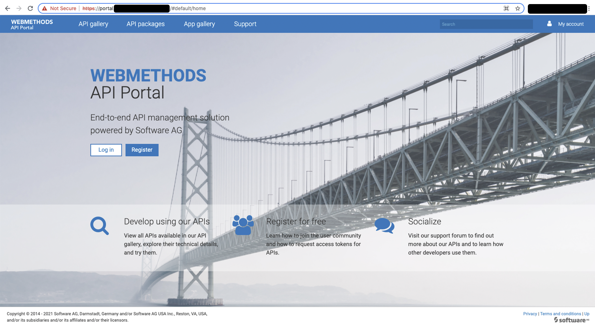

# SAG API Portal
This document describes how to install API Portal on OpenShift. It specifies the values that are required to launch the API Portal containers on OpenShift.

This document contains the following sections:
- [Configuration](#config)
- [Licensing](#licensing)
- [Installation](#installation)

## Configuration <a name="config" />

### Common Values to be set
Below common values should be set appropriately in the values.yaml file to run the containers on Red Hat OpenShift.
```yaml
# Install the SAG webMethods API Portal version you want by setting the correct image versions.
image:
  # use of dockerhub/store registry to pull API Portal images from.
  registry: store
  # Image version releates to the SAG APIM version
  # version: 10.0.14.70 --> SAG APIM 10.7
  # version: 10.0.10.1 --> SAG APIM  10.5
  version: 10.0.14.70
  # Whether to use the Service Account to pull the images from the registery or the 'registrySecret'
  servicePrincipal: false
  # "Always" is recommended during testing with SNAPSHOT versions, otherwise use "IfNotPresent"
  pullPolicy: Always
  # Name of the Docker Registry Secret to pull the image from the dockerhub/store. This is only used when servicePrincipal is set to false
  # This secret must exist in advance, before installing the chart
  registrySecret: regsecret

# Change the default application password for the system account in your password
# Password to be provided in base64 encoding
applications:
  password: ZzNoMzFtCg==

```

### Mounting logs to file share (Recommended)
Set `logs.enabled` to `true` to write all logs to a file share. Make sure you set the `logs.storageClassName`to a valid StorageClass which supports **ReadWriteMany** access mode.

```yaml
logs:
    #set to true to make the template register the NFS share whose endpoint info you need to provide here as a PV+PVC with the PVC name as specified above in logs.pvcName
    #set to false (NOT recommended) to NOT have any logging go to NFS. This will only leave you with K8s logging to STDOUT (which is very limited) and make debugging difficult or impossible
    enabled: true
    # the name (prefixed with the Helm "release name") of a shared folder PVC (NFS or compatible) to which all components will write their logs
    pvcName: logs
    # the available space on the NFS share. Note that making sure that the given amount of space is actually available is outside the responsibility of this Helm chart (in ONLY registers the PV & PVC!)
    storageSize: 5Gi
    # the sub-path in the NFS share to use
    path: "/"
    # Name of the NFS storage class within OCP. Be sure the StorageClass supports ReadWriteMany. If not exists, fill in with "UNSET"
     # NFS is used as ReadWriteMany file system for example to centralize logs.
    # Besides NFS, some other distributed storage system could be used, like Ceph, Azure Files, Gluster...etc
    # A valid StorageClass supporting RWX access mode must exist in advance.
    storageClassName: nfs
    # set to true to enable the redirection of all log files of our application to stdout/stderr (in addition to writing to the files)
    # set to false for now because while the redirection of all log files to stdout/err is neat (since you wouldn't need a file share)
    # for logs, it tends to overflow the default log handling of Docker/Kubernetes due to the sometimes heavy logging of some of our
    # components.
    redirectLogfiles: false
    # since ARIS containers don't redirect all logs to stdout despite setting the above variable to true
    # a new custom container which would just tail logs is used for tailing all logs to stdout
    # set it to true if you want to tail all logs and for this please use fileshare as well
    deployRedirectLogContainer: false
    cpuLimit: "200m"
    memoryLimit: "150Mi"
```

### Monitoring with Prometheus (Optional)
If you are enabling monitoring, you must install prometheus-operator after this
```yaml
monitoring: true
```

### Tolerations for pods (Optional)
If you have taints for your k8s worker nodes, you can specify the tolerations for it in the values.yaml, so that pods can run on those tainted nodes.

Describe your tolerations in the `tolerations` section:
```yaml
- key: "nodepool"
  operator: "Equal"
  value: "apiportal"
  effect: "NoSchedule"
```
Or if you don't tolerate any taints:
```yaml
tolerations: {}
```

### External Mail Server (Recommended)
Setting a mail server is important to receive the account activation mails, password reset mail,.. etc.  
Set smtp values appropriately:
```yaml
# The information is only used if "externalMailServer.enabled" is set to "true"
externalMailServer:
  enabled: true
  host: "<smtp-host>"
  port: "587"
  #set username and password to UNSET if your mail server does not use authentication
  username: "<username>"
  #SMTP password in base64 encoded format
  password: "Pk9IXMZmZWS1ekWqVYhYWC81ZmNwYnVwaWhQb05tZisyWW93QnJWcnU2NTMK"
  #Valid values are UNSET, SSL or STARTTLS. set to UNSET if you don't want to use any form of transport encryption
  tlsMode: "SSL"
  senderAddress: "noreply@yourdomain.com"
```

### Loadbalancer Configuration with OpenShift route
To expose the API Portal gui to outside the cluster you can enable a **Red Hat Openshift Route** or a **Kubernetes Ingress** configuration.

#### Loadbalancer Configuration without ingress
If you want to make use of OpenShift Routes to expose the API endpoint, you must set the flag `loadbalancer.route.enabled` to `false`.
```yaml
loadbalancer:
  replicas: 1
  # Specify whether an OpenShift route should be created. This can only be created when your platform is OpenShift. If you don't use OpenShift, use the Ingress controller.
  route:
    enabled: true
    tls:
      enabled: true
      # Put ssl certificate, ssl key and ca certificate in base64 encoded PEM-format:
      cert: "LS0tLS1.."
      key: "LS0tLS1.."
      cacert: "LS0tLS1.."
  #externalFQDN: "UNSET"
  externalFQDN: "developerss.yourdomain.be"
```
You can enable TLS edge termination by setting the field `loadbalancer.route.tls.enabled` to `true`. The SSL Certificate, the private key and the CA certificate must be put in the value file in (base64-encoded-) PEM-format. For more information click [here](docs/ssl.md).

#### Loadbalancer Configuration with ingress
If you have enabled ingress, please first install nginx ingress. To install nginx ingress, please use below command
```bash
helm install stable/nginx-ingress -n <namespace>
```
Make sure that you will install API Portal also in the same namespace,as used by nginx ingress. If you are going in https mode, please create kubernetes secret for it in the same namespace. Command for creating k8s secret is
```bash
kubectl create secret tls apiportaltls --cert <path>/<to>/<ssl-cert.crt> --key <path>/<to>/<ssl-cert.key > -n <namespace>
```
Once secret is created, you can set up ingress in https mode
```yaml
ingress:
  #set to true to enable the creation of an Ingress object as a layer 7 entrypoint to the application
  # WARNING: if your cluster does not support an Ingress out of the box, some application functionality will not work.
  # For K8s clusters on AWS, you can have the Ingress object trigger the creation of an ALB instance with the ALB ingress controller (see https://kubernetes-sigs.github.io/aws-alb-ingress-controller/)
  # other ingress implementations are available for non-AWS clusters, e.g.,   https://github.com/kubernetes/ingress-nginx
  # note that when using an Ingress, there is little sense in creating the loadbalancer service of type "LoadBalancer"; "NodePort" is sufficient in that case
  # You can also manually provide a layer-7-loadbalancer and let it direct traffic to your cluster's worker nodes, to the NodePort created for the installation's NodePort service
  enabled: true
  type: nginx
  nginx:
    maxBodySize: "250m"
    proxyConnectTimeout: "100"
    proxyReadTimeout: "1800"
    proxySendTimeout: "1800"
  http:
    enabled: false
    port: 80
  https:
    enabled: true
    port: 443
    # the name of a (pre-generated!) secret holding the TLS secret to use when using an NGINX-based ingress
    # leave set to "UNSET" to not have TLS
    secretName: "apiportaltls"
loadbalancer:
  replicas: 1
  # Specify the external full-qualified hostname (e.g., using Route 53) that you plan to map to the ELB instance created
  # for the loadbalancer service. Leave set to "UNSET" to try to automatically determine the ELBs autogenerated (quasi-random) endpoint URL
  # via the K8s API
  externalFQDN: "apiportal.webmethods.com"
  # Allows specifying a regex (in Apache-HTTPD-style) matching all those request source IP addresses from which to accept the
  # X-Forwarded-* (X-Forwarded-For, X-Forwarded-Proto and X-Forwarded-Host) headers and the more recent standardized "Forwarded" header.
  # Only for requests coming from remote IPs matching this regex an X-Forwarded-*/Forwarded header will be passed through to the application,
  # for all other source IP addresses, the X-Forwarded-*/Forwarded header will be removed from the request.
  trustedProxyRegex: "UNSET"
  # Specify the external HTTP(S) (depending on what you set loadbalancer.externalScheme to) port of the ELB instance created for the loadbalancer (e.g., using Route 53)
  # that you plan to map to the ELB instance created.
  # If left at UNSET, the port will be the default port of the chosen scheme (i.e., port 80 in case externalScheme is "http", resp. port 443 in case externalScheme is "https")
  externalPort: "80"
  # Scheme to be used
  externalScheme: "http"
```

#### Loadbalancer Configuration without ingress
For this you need not install any ingress charts. This will create an external IP if service type is set to LoadBalancer. If you don't want external IP, you can set it to NodePort
```yaml
loadbalancer:
  replicas: 1
  # Specify the external full-qualified hostname (e.g., using Route 53) that you plan to map to the ELB instance created
  # for the loadbalancer service. Leave set to "UNSET" to try to automatically determine the ELBs autogenerated (quasi-random) endpoint URL
  # via the K8s API
  externalFQDN: "apiportal.webmethods.com"
  # Allows specifying a regex (in Apache-HTTPD-style) matching all those request source IP addresses from which to accept the
  # X-Forwarded-* (X-Forwarded-For, X-Forwarded-Proto and X-Forwarded-Host) headers and the more recent standardized "Forwarded" header.
  # Only for requests coming from remote IPs matching this regex an X-Forwarded-*/Forwarded header will be passed through to the application,
  # for all other source IP addresses, the X-Forwarded-*/Forwarded header will be removed from the request.
  trustedProxyRegex: "UNSET"
  # Specify the external HTTP(S) (depending on what you set loadbalancer.externalScheme to) port of the ELB instance created for the loadbalancer (e.g., using Route 53)
  # that you plan to map to the ELB instance created.
  # If left at UNSET, the port will be the default port of the chosen scheme (i.e., port 80 in case externalScheme is "http", resp. port 443 in case externalScheme is "https")
  externalPort: "80"
  # Scheme to be used
  externalScheme: "http"
  service:
    #Can be either "NodePort" (if you are running this in a simple local cluster without loadbalancing services) or "LoadBalancer"
    # if your are running this on a cluster on AWS, GKE, etc. . If you have set ingress to true, it will be treated as NodePort
    type: LoadBalancer
    # do not change
    port: 80
    # do not change
    targetPort: 80
    # only used - you guessed it - when service type is set to NodePort
    # set to "UNSET" if you want to automatically assign the actual nodeport
    nodePort: UNSET
```

### Installing non-HA cluster with internal postgres
This is common for any cloud provider. Set all the replica counts to 1. Also enable internal postgres db
```yaml
postgres:
  #set to false to NOT add a Postgres pod, but instead use an external DBMS (whose URL and credentials need then to be specified in the "externalDb" section below)
  enabled: true
```
Once the above configurations are set, the product can be installed by following command
```bash
helm install <any-release-name> api-portal -n <namespace>
```

### Installing non-HA cluster with external postgres
You must have provisioned a postgres server already and created a db in it
```yaml
postgres:
  #set to false to NOT add a Postgres pod, but instead use an external DBMS (whose URL and credentials need then to be specified in the "externalDb" section below)
  enabled: false
externalDb:
  # Set to true if you aren't gonna use the internal postgres pod
  enabled: true
  # Host name or IP address of the database
  host: "apiportalpg.postgres.database.azure.com"
  # Port on which DB is listening
  port: "5432"
  # DB connect url. If you are going to use postgres, then connect URL must be like "jdbc:postgresql://<DBHost>:<DBPort>/<DBName>" . If you're gonna use
  # Oracle as external database, then connect URL must be like "jdbc:oracle:thin:@<DBHost>:<DBPort>:<DBSID>"
  dbUrl: "jdbc:postgresql://apiportalpg.postgres.database.azure.com:5432/arisdb"
  # DB user name with admin privileges
  username: "aris@apiportalpg"
  # DB password in base64 encoded format
  password: "QXAhcG9ydGFscGFzc3dk"
  # Database type. If you gonna use oracle as external Db, then set this value to oracle. If you gonna use postgres as external Db, then set this value to postgres
  type: "postgres"
  # Admin user details using which new tenants can be created
  admin:
    # DB user name with admin privileges
    username: "aris@apiportalpg"
    # DB password in base64 encoded format
    password: "QXAhcG9ydGFscGFzc3dk"
  # Tenant schemas that has to be created
  tenantSchemas:
    master: "aris_master"
    default: "aris_default"
```
Once the above configurations are set, the product can be installed by following command
```bash
helm install <any-release-name> api-portal -n <namespace>
```

### Installing HA cluster
You must have provisioned a postgres server already and created a db in it. You should set externalDb.enabled value to true. Set zookeeper,elasticsearch and kibana replicas to 3. Set cloudsearch replicas to 2. Set other applications replicas to 2 or more
```bash
helm install <any-release-name> api-portal -n <namespace>
```

### Enabling Horizontal Pod Autoscaling
If you are using EKS, then you have to install kubernetes metric server. Once it is set, horizontal pod autoscaling for each application can be enabled. Set autoscale property to true for whichever application you require. Pods will be scaled based on memory utilization of pod. Threshold value is 80%
```yaml
applications:
# that approach doesn't work, see https://stackoverflow.com/questions/52742241/dynamically-accessing-values-depending-on-variable-values-in-a-helm-chart
# the values specified in the default section are used for any application for which no individual value is set
  default:
    replicas: 1
  accserver:
    # -1 indicates that the value applications.default.replicas should be used as the initial number of replicas for this application
    replicas: 1
    # Intial delay seconds for liveness probe to begin
    initialDelaySeconds: 60
    # Health check url for the service
    healthCheck: /aris/container/checkReadiness.sh
    autoscale: true
    maxReplica: 4
    version: UNSET
    ...
  ...
```
## Licensing <a name="licensing" >
During the API Portal installation, a Kubernetes job uploads the license file into the API Portal instance. The job uses the API Portal UMC API to upload the license file. The license file should be stored within the files folder of the API Portal chart (`charts/sag-apiportal/files`) with filename `license.xml`. In order to upload this license, you must set the field `applications.license.useYourOwnLicense` to `true`.
```yaml
applications:
  license:
    # Set to true if your own license is used, set to false if the trail license must be used.
    useYourOwnLicense: true
    # This is the name of the license file which must be put in the ./files folder of the Helm application
    fileName: license.xml
```

## Installation <a name="installation">

### STEP 0 : Initialize Openshift
- Create Project
```sh
OC_PROJECT=sag-api-management
oc new-project $OC_PROJECT
```
- Make sure that the service account which runs our pods has access to the privileged SCC.
```sh
oc adm policy add-scc-to-user privileged system:serviceaccount:$OC_PROJECT:default
 ```
### STEP 1: Create Docker Secret
The cluster must be able to download the image from DockerHub. Therefore, create a secret for [Docker hub](https://hub.docker.com/) access. This dockerhub account must also already be registered to have a proper [license](https://hub.docker.com/_/softwareag-apiportal) for the API Portal. Otherwise, the images cannot be downloaded during the installation process.
The name of the registry secret must match with the Helm variable `image.registrySecret` of your specific Helm *Values* file. 
```sh
oc create secret docker-registry regsecret --docker-server=https://index.docker.io/v1/ --docker-username=<your-docker-hub-id> --docker-password="<your-pass>" --docker-email="your-email"
```
The name of the secret **regsecret** is configured in the Helm configuration so the images are downloaded with the proper Docker Hub credentials.

### STEP 2: Install API Portal using Helm
Same as with the API Gateway installation, you have to make sure the Helm configuration file (Value file) contains the correct configuration.
```sh
helm install sag-apiportal ./charts/sag-apiportal -f ./charts/sag-apiportal/values.yaml
```
If the rollout was successful, the following output is shown:
```txt
NAME: sag-apiportal
LAST DEPLOYED: Mon Oct 18 21:13:08 2021
NAMESPACE: sag-api-management
STATUS: deployed
REVISION: 1
TEST SUITE: None
NOTES:
************************************************************************
*** PLEASE BE PATIENT: API Portal may take a few minutes to install ***
************************************************************************

SAG API Portal
---------------

You have deployed release: sag-apiportal.
1. Get your API Portal UI endpoint:
export PORTAL_HOST=$(oc get route sag-apiportal-portal -o jsonpath='{.spec.host}')
You should be able to access the API Gateway management GUI in a browser through address: https://$PORTAL_HOST
```
Check that all pods are running and that post deployment jobs ran successfully:
```sh
kubectl get po
returns:
NAME                                                  READY   STATUS      RESTARTS   AGE
sag-apiportal-accserver-0                             1/1     Running     0          2m28s
sag-apiportal-adsadmin-0                              1/1     Running     0          2m28s
sag-apiportal-api-0                                   1/1     Running     0          2m28s
sag-apiportal-change-passwords-tenant-default-bct7w   0/1     Completed   0          2m28s
sag-apiportal-change-passwords-tenant-master-66rfz    0/1     Completed   0          2m28s
sag-apiportal-cloudsearch-0                           1/1     Running     0          2m28s
sag-apiportal-collaboration-0                         1/1     Running     0          2m28s
sag-apiportal-create-tech-user-6cmpr                  0/1     Completed   0          2m28s
sag-apiportal-elasticsearch-0                         1/1     Running     0          2m28s
sag-apiportal-import-license-kws9b                    0/1     Completed   0          2m28s
sag-apiportal-kibana-0                                1/1     Running     0          2m28s
sag-apiportal-loadbalancer-0                          1/1     Running     0          2m28s
sag-apiportal-portalserver-0                          1/1     Running     0          2m28s
sag-apiportal-postgres-0                              1/1     Running     0          2m28s
sag-apiportal-register-smtp-server-w5z5r              0/1     Completed   0          2m28s
sag-apiportal-tm-0                                    1/1     Running     0          2m28s
sag-apiportal-umcadmin-0                              1/1     Running     0          2m28s
sag-apiportal-zookeeper-0                             1/1     Running     0          2m28s
```
### STEP 3: Test & Verify
- Get your API Portal UI endpoint
```sh
oc get route sag-apiportal-portal -o jsonpath='{.spec.host}'
```
- Add http:// or https:// (depends on whether you enabled tls or not in your route) before the endpoint and open this URL in a browser

If your installation was successful the following opening sreen is shown in your browser:   
