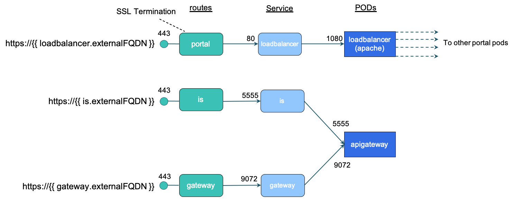

# SSL/TLS
This section describes how to activate SSL endpoints within your API Management stack. Although you can use your own certificates, we start with the creation of a CA (Certificate Authority) and the SSL certificate(s).

To enable TLS we configure OpenShift routes with [edge TLS termination](https://docs.openshift.com/container-platform/4.7/networking/routes/secured-routes.html#nw-ingress-creating-an-edge-route-with-a-custom-certificate_secured-routes). This relieves us from cofiguring SSL within the applications.



Note: Although the API Portal and API Gateway contains many internal endpoints we only activate TLS on those endpoints which are exposed outside the cluster, via Openshift **routes** or Kubernetes **ingress** configuration.

Steps:
- [Create CA](#ca)
- [Create Certificate](#certificate)
- [Portal Configuration](#portal)
- [API Gateway Configuration](#apigw)


## Create CA <a name="ca" />
We sign our certificates using a self-created *certificate authority*. The following two steps should only be executed one time:
### Create CA Key
Create the CA root key with the following command:
```sh
openssl genrsa -des3 -out ca.key 4096
```
### Create and self sign root CA
Create a root CA certificate and sign it with your CA key created previously:
```sh
openssl req -x509 -new -nodes -key ca.key -sha256 -days 1024 -out ca.crt
```
## Create a certificate <a name="certificate" />
```sh
openssl genrsa -out domain.be.key 2048
openssl genrsa -out apps.ocp1-id.id.internal.key 2048
```
### Create the CSR (Certificate Signing Request)
Make sure to specify a proper **Common Name** by providing the IP address or domain name of your ssl endpoint.

```sh
openssl req -new -sha256 -key apps.ocp1-id.id.internal.key -subj "/C=BE/ST=Antwerp/O=i8c/CN=sag-apim-portal-sag-api-management.apps.ocp1-id.id.internal"  -out sag-apim-portal-sag-api-management.apps.ocp1-id.id.internal.csr
openssl req -new -sha256 -key domain.be.key -subj "/C=BE/ST=Antwerp/O=i8c/CN=sag-apim.mydomain.be"  -out domain.be.csr
```
### Verify the CSR
```sh
openssl req -in sag-apim-portal-sag-api-management.apps.ocp1-id.id.internal.csr -noout -text
openssl req -in domain.be.csr -noout -text
```
### Create the Certificate based on the CSR
```sh
openssl x509 -req -in sag-apim-portal-sag-api-management.apps.ocp1-id.id.internal.csr -CA ca.crt -CAkey ca.key -CAcreateserial -out sag-apim-portal-sag-api-management.apps.ocp1-id.id.internal.crt -days 365 -sha256
openssl x509 -req -in domain.be.csr -CA ca.crt -CAkey ca.key -CAcreateserial -out domain.be.crt -days 365 -sha256
```
### Verify the Certificate
```sh
openssl x509 -in domain.be.crt -text -noout
```

## API Portal Configuration <a name="portal" />
The API Portal exposes one endpoint (the loadbalancer endpoint) for which we can enable TLS by simply enabling it in the Helm values-file in the **sag-apiportal** Helm chart. We also need to include the TLS certificate, TLS key and the certificate of the certificate authority in base64 encoding. Helm will put the certificates within the OpenShift `route` configuration.  
Within your Helm values-file you should have a configuration similar like the following:
```yaml
loadbalancer:
  route:
    enabled: true
    tls:
      enabled: true
      # Put ssl certificate, ssl key and ca certificate in base64 encoding:
      cert: "LS0tLS1CRUd..."
      key: "LS0tLS1CRUdJ..."
      cacert: "LS0tLS1CRU...."
  externalFQDN: "portal.yourdomain.com"
```
Note: Make sure that the **Common Name** of your SSL certificate is equal to the hostname of your endpoint. You can get this hostname with the following command:
```sh
oc get route <route name>  -o json | jq -e -r .spec.host
```

## API Gateway Configuration <a name="portal" />
The API Gateway exposes two endpoints, one for the API Gateway UI and the other one for the Integration Server, which also fullfils the role of API endpoint. Just like configuring TLS on the API Portal, you can enable TLS by setting the following Helm values in the **sag-apigateway** Helm chart:

Again, if you enable TLS, make sure the CN of  your SSL certificate matches with your endpoint url, the *externalFQDN*.

### Integration Server
```yaml
is:
  route:
    enabled: true
    tls:
      enabled: true
      # Put ssl certificate, ssl key and ca certificate in base64 encoding:
      cert: "LS0tLS1CRUiBDRV..."
      key: "LS0tLS1CRUdU0EgU..."
      cacert: "LS0tLS1CRUdJT...."
  externalFQDN: "api.yourdomain.com"
```

### API Gateway
```yaml
apigateway:
  route:
    enabled: true
    tls:
      enabled: true
      # Put ssl certificate, ssl key and ca certificate in base64 encoding:
      cert: "LS0tLS1CRUdJTiBD..."
      key: "LS0tLS1CRUdJTEgUF..."
      cacert: "LS0tLS1CRUdDRV..."
  externalFQDN: "manager.yourdomain.com"
  ```